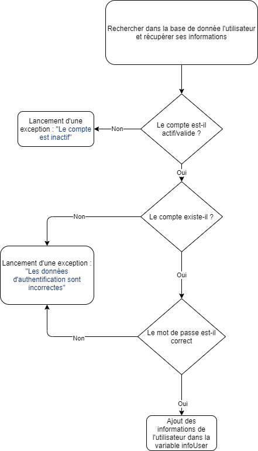
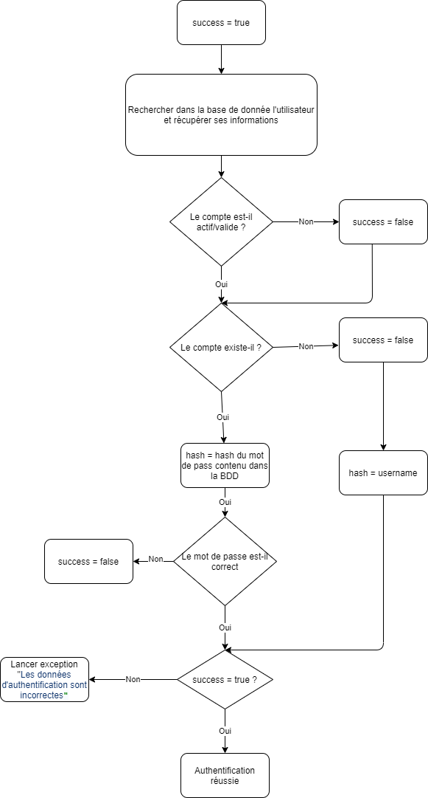

# Timing Attack

## Analyse dynamic

L'analyse dynamique à consister à employer le projet Ruby suivant permettant de détecter ces vulnérabilités : https://github.com/ffleming/timing_attack

- Test 1 

Test effectué sur le champ fLogin avec le mot de passe `user`, qu'on sait être dans la base de donnée

```bash
timing_attack -u http://localhost:8080/index.php?action=vue_login -b -p  --parameters '{"fLogin":"INPUT", "fPasswd":"user"}'
```

Résultat : Pas de timing attack détecté

- Test 2 

  Test effectué sur

```bash
timing_attack -q  -u http://localhost:8080/index.php?action=vue_login  -p  --parameters-file params.txt \
                      --inputs-file inputs.txt

```

Résultat : on ne peut pas conclure que l'application est vulnérable

```bash
ming_attack -q  -u http://localhost:8080/index.php?action=vue_login  -p  --parameters-file params.txt \
                      --inputs-file inputs.txt

```


Résultat : on ne peut pas conclure que l'application est vulnérable

Quelques sources intéressants pour creuser le sujet :

- Serveur telnet : [http://shoxx-website.com/2013/12/timing-attack-le-temps-est-precieux.html]( http://shoxx-website.com/2013/12/timing-attack-le-temps-est-precieux.html)
- [https://github.com/sqreen/DevelopersSecurityBestPractices/tree/master/_practices/timing-attack/_python](https://github.com/sqreen/DevelopersSecurityBestPractices/tree/master/_practices/timing-attack/_python)
- [https://sqreen.github.io/DevelopersSecurityBestPractices/timing-attack/python](https://sqreen.github.io/DevelopersSecurityBestPractices/timing-attack/python)

## Analyse statique

L'analyse statique à consister  à regarder le code manuellement. La fonction analysée est la suivante :

### Code

```php
 */
function checkLogin($postArray)
{
    $username = $postArray ["fLogin"];
    $passwdPost = $postArray["fPasswd"];
    $resultats = getUserByLogin($username);
    $resultats = $resultats->fetch();
    if ($resultats['isValid'] == 0) {
        throw new Exception("Le compte est inactif");
    }
    if (empty($resultats['name'])) {
        throw new Exception("Les données d'authentication sont incorrectes");
    }
    $hash = $resultats['password'];
    if (password_verify($passwdPost, $hash)) {
        //Initialisation du tableau qui va contenir les informations de l'utilisateur.
        $infoUser = array(
            'email' => $resultats['email'],
            'idUser' => $resultats['id'],
            'login' => $resultats['name'],
            'idRole' => $resultats['idRole'],
        );
    } else {
        throw new Exception("Les données d'authentication sont incorrectes");
    }
    return @$infoUser;//renvoie certaines infos de l'utilisateur
}
```

### Conclusion

On peut constater que le programme s'effectue de la façon suivante :



Il est potentiellement possible effectuer une timing attack pour déterminer si un utilisateur existe dans la base de donnée ou non car lorsqu'il n'existe pas,  aucun calcul de hash des mots de passe n'est effectué

La fonction utilisée pour vérifier les hash, `password_verify` est néanmoins protégé contre les timing attack selon la documentation officielle PHP : [www.php.net/manual - password-verify](https://www.php.net/manual/fr/function.password-verify.php)

Autres problèmes constatés : Le fonctionnement du programme permet de potentiellement déterminer si un compte existe ou pas. Tout d'abord si le compte est inactif, un message d'erreur spécifique est renvoyé

Le workflow corrigé est le suivant :

