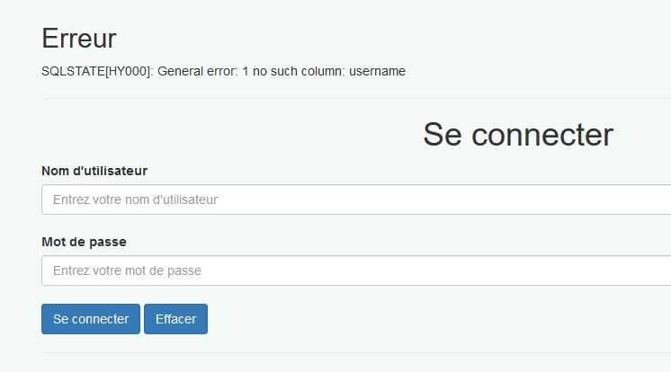

# Injection SQL

## Test

Sur la page principal  pour se connecter : `index.php?action=vue_login`

- Test 1 : OR

Avec l'input suivante :

```
user'OR 1=1
```


On obtient l'erreur sql suivante indiquant qu'une injection sql est possible

```
SQLSTATE[HY000]: General error: 1 unrecognized token: "'" 
```

Test 2  : UNION

Avec UNION, on remarque que la requête est exécutée.

```
test'UNION SELECT username, password FROM user--
```

Elle donne éponse : `SQLSTATE[HY000]: General error: 1 no such table: users `

Ainsi on peut voir que sql exécute la requête mais renvoie une erreur car celle-ci n'a pas trouvé la table users.



## Conclusion

Les tests montrent que les requêtes ne sont pas protégées. Par manque de temps, nous n'avons pas pu faire en sorte de pouvoir les exploiter